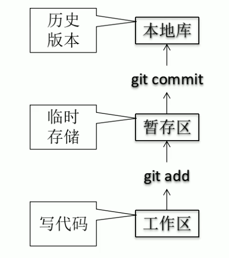
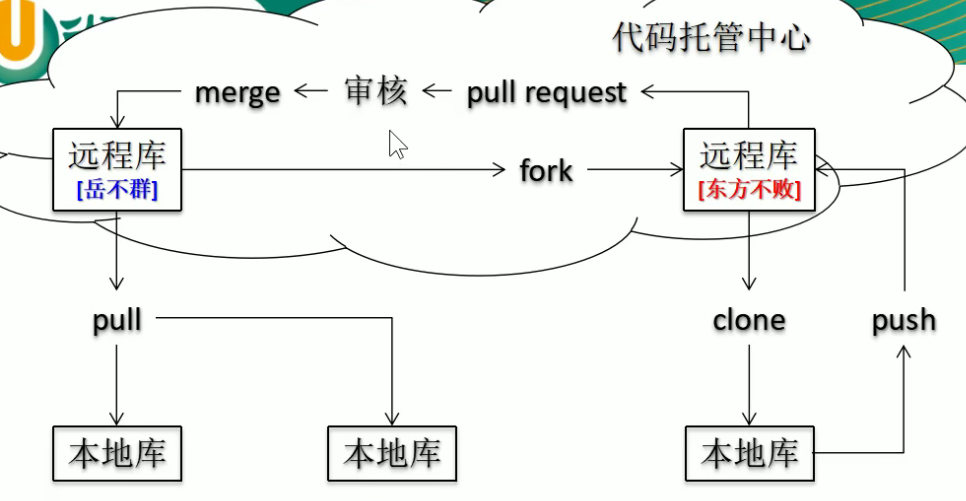
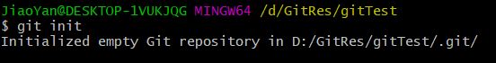
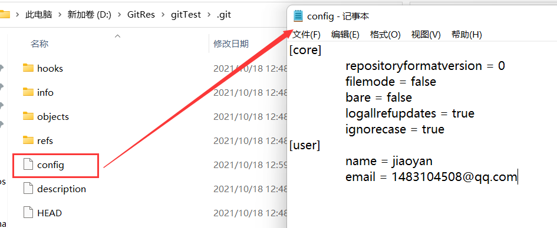
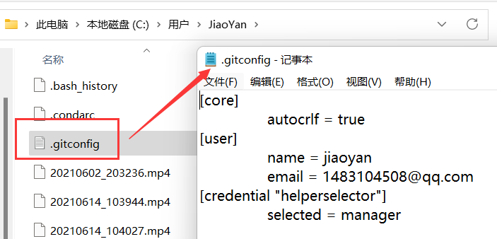
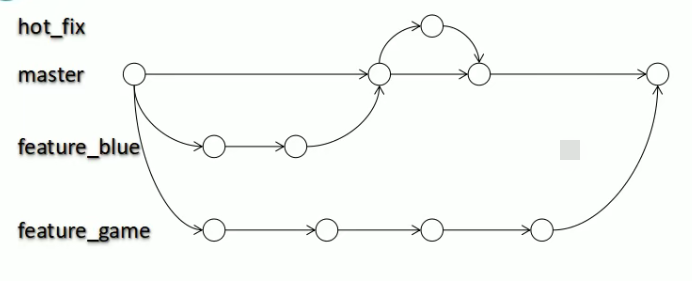
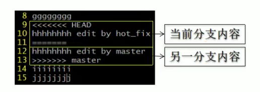

[TOC]

# Git

## Git简介

### 1.git的优势

1. 大部分在本地完成，不需要联网
2. 完整性保证
3. 尽可能添加数据而不是删除或修改数据
4. 分支操作非常快捷流畅
5. 与Linux命令全面兼容

### 2.git结构



本地库通过`git push`提交到远程库。

远程库到本地库通过`git clone`下载

远程库到远程库复制`git fork`




## Git基本命令

### 1.本地库初始化

- 命令

```shell
git init
```

- 效果



- 注意

  运行后生成.git文件，.git文件存放的是本地库相关的子目录和文件不能删除和修改。

### 2.设置签名

- 形式

  用户名：

  Email：

- 作用

  区分不同的开发人员身份

- 辨析

  与远程库的账号密码没有关系

- 命令

  - 项目级别/仓库级别：尽在当前本地库有效

    ```shell
    git config user.name xxx
    git config user.email xxxx@xx.com
    ```

    信息保存位置为.git目录下config文件

    

  - 系统用户级别：大恩如当前操作系统的用户范围

    ```shell
    git config --global user.name xxx
    git config --global user.email xxxx@xx.com
    ```

    信息保存位置：~/.gitconfig文件

    

  - 级别优先级

    就近原则：项目级别优先于系统用户级别

    如果只有系统用户级别的签名，就以系统用户级别签名为准

    二者都没有不允许


### 3.提交以及查看状态

- 查看状态

  ```
  git status
  ```
  查看工作区，暂存区状态。

- 添加到暂存区

  ```
  git add  [file name]
  ```

  将工作区的新建/修改添加到暂存区

- 取消暂存

  ```
  git rm --cached xxxx
  ```

- 提交

  ```
  git commit -m "commit message" [file name]
  ```

  将暂存区的内容提交到本地库

### 4.查看历史记录

```
git log
```

多屏显示控制方式：

- 空格向下翻页
- b向上翻页
- q退出

简洁：

```
git log --pretty=oneline
```

更简洁版（hash缩短）

```
git log --oneline
```

显示了到某个版本需要几步

```
git reflog
```

### 5.前进后退

- 基于索引值

  ```
  git reset --hard [hash code]
  ```

- 使用^：只能往后

  ```
  git reset --hard HEAD^
  ```

  注：一个^退一步

- 私用~：

  ```
  git reset --hard~n
  ```

  注：后退n步

### 6.查看文档

```
git help [命令]
```

### 7.reset命令三个参数对比

- --soft

  - 仅仅在本地库移动HEAD指针

    本地库后退

- --mixed参数

  - 在本地库移动HEAD指针

  - 重置暂存区

    本地库和暂存区后退

- --hard参数

  - 在本地库移动HEAD指针

  - 重置暂存区

  - 重置工作区

    本地库，暂存区，工作区一起后退

### 8.删除文件找回

前提：删除前，文件存在时的状态提交到了本地库。

操作：`git reset --hard [指针位置]`

- 删除操作已经提交到本地库：指针位置指向历史记录
- 删除操作尚未提交到本地库：指针位置使用HEAD

### 9.比较文件差异

```
git diff [文件名]
```

将工作区文件与暂存区比较。

```
git diff [本地库历史版本] [文件名]
```

将工作区文件和本地库历史记录比较

注：不带文件名比较多个文件

### 10.添加远程库

```
git remote add [远程名称] [仓库地址]
```

### 11.推送代码

```
git push <远程主机名>  <本地分支名>:<远程分支名> 
```

同名可以忽略冒号

### 12.克隆代码

```
git clone [仓库地址]
```

1. 完整的把远程库下载到本地
2. 创建origin远程地址别名
3. 初始化本地库

### 13.抓取仓库

pull = fetch +merge

```
git fetch [远程主机名] [分支名]
```

同步远程库

## 分支管理

### 1.什么是分支

在版本控制过程中，使用多条线同时推进多个任务。



### 2.分支的好处

1. 同时并行推进多个功能的开发。
2. 各个分支在开发过程中，如果某个分支开发失败，不会对其他分支有影响，彼此独立。

### 3.创建分支

```
git branch [分支名]
```

### 4.查看分支

```
git branch -v
```

### 5.切换分支

```
git checkout [分支名]
```

### 6.合并分支

A 合并到 B

1. 切换到接受修改的分支（被合并，增加新内容）

   ```
   git checkout [B分支名]
   ```
   
2. 执行`merge`命令

   ```
   git merge [A分支名]
   ```

### 7.解决冲突

当两个分支都修改了同一个文件那么会产生冲突。

进入冲突文件后会表现为：



冲突解决：

1. 编辑文件，删除特殊符号
2. 把文件修改到满意的程度，保存退出
3. `git add [文件名]`
4. `git commit -m "message"`。注：commit一定不能带文件名


## Git的基本原理

### 1.数据完整性

Git采用哈希算法机制从根本上保证数据的完整性。

### 2.Git保存版本的机制

Git把数据看作是小型文件系统的一组快照，每次提交更新git都会对当前全部文件制作一个快照，并且保存这个快照的索引，如果文件没有修改，Git不再重新存储该文件，而是只保留一个链接指向之前存储的文件。

### 3.Git分支管理

采用链表进行管理控制。

指针指向一个版本。

多个分支就是多个指针。
