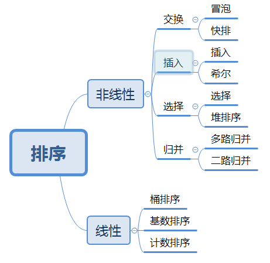

[TOC]

# Java

## Java基础

### 一，== 和equals的区别

https://blog.csdn.net/javazejian/article/details/51348320
对于基础类型，如int，double...只能采用== 进行比较，且比较的是数值
对于引用类型，可以采用和equals进行比较，比较的是两个引用的引用地址， 及两个引用引用的是否为一个对象，而equals则是Object方法进行提供的，如果不进行重写，其比较的也是引用
Object中equals

```java
public boolean equals(Object obj) {
        return (this == obj);
    }
```

其和==相同
当我们重写其以后，就可以按照我们的要求进行比较
和比较有关系的还有个方法叫做hashcode
equals和hashcode有以下的关系

1.equal()相等的两个对象他们的hashCode()肯定相等，也就是用equal()对比是 绝对可靠的。

2.hashCode()相等的两个对象他们的equal()不一定相等，也就是hashCode()不 是绝对可靠的。

因为hashcode可能存在碰撞

在使用HashMap的时候在重写equals方法的时候，一定要重写hashCode方 法。

有这个要求的症结在于，要考虑到类似HashMap、HashTable、HashSet的这 种散列的数据类型的运用。

### 二，String，StringBuffer，StringBuilder的区别

String在进行修改后会生成新的对象，其内部char[]通过finalStringBuffer和StringBuilder可以通过方法进行字符串修改，并且不会生成新的对象

StringBuffer是线程安全的

StringBuilder线程不安全适合在单线程下运行

### 三，什么是序列化和反序列化

https://blog.csdn.net/qq_27093465/article/details/78544505
序列化：把对象转换为字节序列的过程
反序列化：把字节序列转化为对象的过程
使用情况：

1. 需要将对象持久化，存储在数据库或者文件中的时候
2. 需要用Socket套接字传输对象的时候

需要注意的是序列化的类必须实现Serializable接口，并且被transient修饰的 字段不参与序列化

## 排序



https://www.cnblogs.com/onepixel/articles/7674659.html

### 一，快速排序

### 二，归并排序

### 三，冒泡排序

### 四，插入排序

### 五，选择排序

### 六，堆排序

### 七，希尔排序

### 八，桶排序

### 九，基数排序

### 十，计数排序

## 多线程

### 一，线程池是什么？

线程池是一种多线程的处理形式，处理过程中将任务添加到队列，然后在创建线程后自动启动这些任务。线程池线程都是后台线程。每个线程都使用默认的堆栈大小，以默认的优先级运行。也可以传入自己的线程工厂。

### 二，run()和start()的区别

run只是调用了普通方法，其内部的是线程的线程体

start启动的是线程

启动一个线程是调用start方法，使得线程处于就绪状态，在获取cpu时间片后，就可以直接执行了。

### 三，线程池中Submit和execute的区别

```java
/**
     * @throws RejectedExecutionException {@inheritDoc}
     * @throws NullPointerException       {@inheritDoc}
     */
    public Future<?> submit(Runnable task) {
        if (task == null) throw new NullPointerException();
        RunnableFuture<Void> ftask = newTaskFor(task, null);
        execute(ftask);
        return ftask;
    }

    /**
     * @throws RejectedExecutionException {@inheritDoc}
     * @throws NullPointerException       {@inheritDoc}
     */
    public <T> Future<T> submit(Runnable task, T result) {
        if (task == null) throw new NullPointerException();
        RunnableFuture<T> ftask = newTaskFor(task, result);
        execute(ftask);
        return ftask;
    }

    /**
     * @throws RejectedExecutionException {@inheritDoc}
     * @throws NullPointerException       {@inheritDoc}
     */
    public <T> Future<T> submit(Callable<T> task) {
        if (task == null) throw new NullPointerException();
        RunnableFuture<T> ftask = newTaskFor(task);
        execute(ftask);
        return ftask;
    }
```

可以看出，submit直接将执行体丢给了execute执行

所以当你不需要一个结果，那么就老老实实使用execute，如果你需要的是一个空结果，那么 submit(yourRunnable) 与 submit(yourRunnable,null) 是等价的

### 四，多线程使用的场景

对于单核CPU，如果是CPU密集型的任务，如解压文件，多线程的性能反而不如单线程性能，因为解压文件需要一直占用CPU资源，如果采用多线程，线程切换导致的开销反而会使得性能下降，但是对于比如交互类型的任务，肯定需要使用多线程。

对于多核CPU，对于解压文件来说，多线程肯定优于单线程，因为多个线程能够更加充分利用每个核的资源，虽然多线程能够提高程序性能，但是相对于单线程来说，它的编程要复杂的多，要考虑线程安全问题，因此在实际编程过程中，要根据实际情况具体选择。

## JVM

### 一，Java类为什么要采用双亲委派模型 

为了防止不可信的类扮演被信任的类：例如类java.lang.Object，它存放在 rt.jar中，无论哪个类加载器(Application,Extension)要加载这个类，最终都会 委派给启动类(BootStrap)加载器进行加载，因此Object类在程序的各种类加载 器环境中都是同一个类。相反，如果用户自己写了一个名为java.lang.Object的 类，并放在程序的Classpath中，那系统中将会出现多个不同的Object类，java 类型体系中最基础的行为也无法保证，应用程序也会变得一片混乱。

### 二，什么是双亲委派模型

如果一个类加载器收到了加载某个类的请求,则该类加载器并不会去加载该类,而是把这个请求委派给父类加载器,每一个层次的类加载器都是如此,因此所有的类加载请求最终都会传送到顶端的启动类加载器;只有当父类加载器在其搜索范围内无法找到所需的类,并将该结果反馈给子类加载器,子类加载器会尝试去自己加载.

### 三，如何实现自定义类加载器

继承**ClassLoader**然后重写其方法

如果想打破双亲委派模型 重写findClass，否则重写loadClass

### 四，Java垃圾回收如何确认垃圾

引用计数（Java不采用），原因：内存开销，引用环

可达性分析：从一定有用的东西（暂停虚拟机：局部变量，静态变量，Native所引用的对象，活动线程）出发，看能否访问

### 五，Java的垃圾回收算法

基础假设：大部分对象只存在很短的时间

将内存分为新生代，老生代

新生代分为Eden，Survivor1，Survivor2

新生代的GC叫 MinorGC

每次清理

Eden+Survivor1 ->Survivor2

Eden和Survivor1清理

下一次

Eden+Survivor2->Survivor1

Eden和Survivor2清理

当Survivor区存不下了或者超过年龄阈值（JVM默认15）就将年龄大的存放到老生代

当老生代满了则进行Major/Full GC

老生代采用Compact算法

### 六，Java虚拟机的配置

-XX:NewRatio  老生代/新生代比，默认2

-XX:SurvivorRatio Eden/Survivor比例，默认8

-XX:MaxTenuringThreshold 新生代转至老生代阈值，默认15

### 七，内存持久代中包含什么

1. ClassLoader读进来的Class，除系统CLass外
2. 放置String.intern后的结果

易出现OutOfMemoryError:PermGen Space

### 八，解决OutOfMemoryError:PermGen Space

-XX:MaxPermSize 调整大小

### 九，Java1.8Metaspace和PermGen的区别

1. Java1.8使用Metaspace，取消了PermGen Space
2. String.intern的结果被放入堆
3. Metaspace默认不设限制，使用系统内存

### 十，谈谈Java垃圾回收机制

1. 垃圾回收在什么时候运行

   内存分配失败，还有调用`System.gc()`的时候

2. 垃圾回收对什么对象进行回收

   根据可达性分析来查找不用的对象

3. 垃圾回收算法对内存划分了那些区域

   新生代（Eden，Survivor1，Survivor2   copy算法），老生代（compact算法），持久代（Class）


## 并发

### 一，volatile关键字的底层实现，volatile是不是原子性的

底层保证缓存的一致性，在汇编代码之前加了lock指令，保证了在其他线程修改此变量之后，其他线程是可见的

不是原子性，它保证了顺序性和可见性。对任意单个volatile变量的读/写具有原子性，但类似于volatile++这种复合操作不具有原子性。

### 二，volatile与synchronized的区别

### 三，Synchronized的作用

能够保证在同一时刻只有一个线程执行该代码，以达到保证并发安全的效果。

### 四，Synchronized的两个用法

- 对象锁：包括方法锁（默认锁对象为this当前实例对象）和同步代码块锁（自己制定锁对象）
- 类锁：修饰静态方法或指定锁为Class对象

### 五，多线程访问同步方法的7种情况

1. 两个线程同时访问一个对象的同步方法

   一次只能执行一个

2. 两个线程访问的是两个对象的同步方法

   相互不影响，因为锁定的是不同的实例

3. 两个线程访问的是synchronized的静态方法

   一个一个的执行，因为Synchronized的静态方法获取的是类锁

4. 同时访问同步方法和非同步方法

   同时执行

5. 访问同一个对象的不同的普通同步方法

   同一个实例来讲，逐个执行，因为获取的是当前实例的对象锁

6. 同时访问静态Synchronized和非静态Synchronized

   同时运行，因为一个加的是对象锁，一个是类锁

7. 方法抛出异常后会释放锁

   Lock中不会释放，synchronized会自动释放

总结：

- 一把锁只能同时被一个线程获取，没有拿到锁的必须等待
- 每个实例都对应有一个锁，不同实例直接不影响，锁对象为.class或者synchronized修饰的static方法时，所有对象共用一个类锁
- 无论方法正常执行或者抛出异常，都会释放锁

### 六，synchronized的性质

- 可重入：同一线程的外层函数获取锁以后，内层函数可以直接再次获取该锁。

  好处：避免死锁，提升封装性，原理在于：**加锁次数计数器**

-  不可中断：如果锁被别人获取，只能选择等待或者阻塞

###  七，synchronized使用的注意点

1. 锁对象不能为空
2. 作用域不能过大
3. 避免死锁

## IO

## NIO

### 一，JavaNIO的工作原理

1. 通过Selector来进行事件的分发
2. 事件到的时候触发，而不是监视事件

### 二，NIO的核心

1. Selector：通过调用select方法可以从所有Channel中找到需要服务的实例
2. Channel：代表一个通道可以进行读和写
3. Buffer：提供读写数据的缓存


### 	