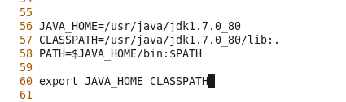

[TOC]

# Linux

## 系统

### 一，Linux用户态和内核态区别

用户态为3的特权级，也是最低的特权级，不能调用系统调用

内核态为0的特权级，为最高特权，内核态用来处理一些系统调用，异常和外围设备的中断

## 命令

## 常用操作

### 一，Linux中安装Java

1. 先tar zxf解压Java压缩包

2. 通过mv命令将java移动到usr目录下

3. 配置环境变量：vi  /etc/profile

   

4. 重启

