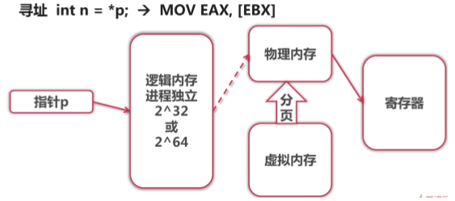

[TOC]

# 操作系统

## 进程和线程

### 一，进程和线程的区别？

1. 进程：包括多个线程，有逻辑内存，有文件和网络句柄
2. 线程：栈(调用堆栈)，PC（program count）指向内存，TLS（Thread Local Storage 独立内存）用来运行程序

### 二，进程间通信的方式

1. 文件 
2. Signal
3. 消息队列
4. 管道/命名管道
5. 共享内存（单机MYSQL）
6. 同步机制，如信号量 7. Socket

## 存储

### 一，程序的寻址方式

