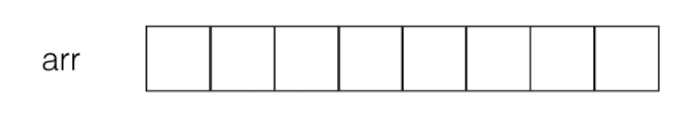
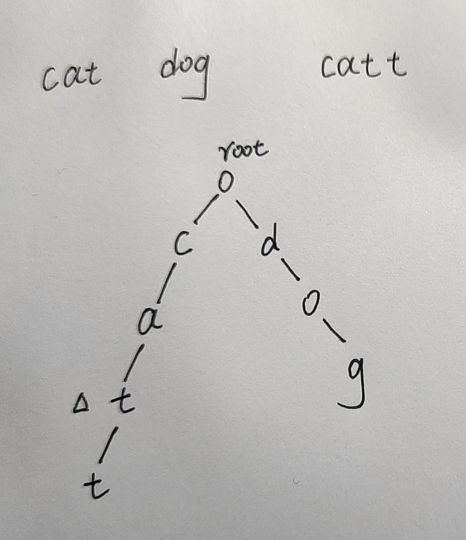

[TOC]


# 数据结构

## 时间复杂度

O(1),O(n),O(lgn),O(nlogn),O(n^2)

大O描述的是算法的运行时间和输入数据之间的关系。

### 为什么要用大O，叫做O(n)?

忽略常数，实际时间T=c1*n + c2；

| 公司              | 时间复杂度 |
| ----------------- | ---------- |
| T = 2*n +2        | O(n)       |
| T = 2000*n +10000 | O(n)       |
| T = 1*n*n+0       | O(n^2)     |

渐进时间复杂度，描述n趋近于无穷的情况。


## 数组

将数据码成一排进行存放。



编号从0开始，结束为数组长度减1.

```java
package Array;

public class Array<E> {
    private E[] data;
    private int size;

    /**
     * 构造函数，传入数组的容量capacity构造Array
     *
     * @param capacity 数组容量
     */
    public Array(int capacity) {
        data = (E[])new Object[capacity];
        size = 0;
    }

    /**
     * 无参数的构造函数，默认数组的容量capacity=10
     */
    public Array() {
        this(10);
    }

    /**
     * 获取数组中的元素个数
     *
     * @return 数组中元素个数
     */
    public int getSize() {
        return size;
    }

    /**
     * 获取数组的容量
     *
     * @return 数组容量
     */
    public int getCapacity() {
        return data.length;
    }

    /**
     * 返回数组是否为空
     *
     * @return 数组是否为空
     */
    public boolean isEmpty() {
        return size == 0;
    }

    /**
     * 添加一个元素
     *
     * @param e 待添加元素
     */
    public void addLast(E e) {
        if (size == data.length) {
            throw new IllegalArgumentException("AddLast failed. Array is full.");
        }
        data[size] = e;
        size++;
    }

    /**
     * 在index位置插入e
     *
     * @param index
     * @param e
     */
    public void add(int index, E e) {
        if (size == data.length) {
            throw new IllegalArgumentException("Add failed. Array is full.");
        }
        if (index < 0 || index > size) {
            throw new IllegalArgumentException("Add failed.Require index>=0 and index<=size.");
        }
        for (int i = size - 1; i >= index; i--) {
            data[i + 1] = data[i];
        }
        data[index] = e;
        size++;
    }

    /**
     * 在所有元素之前添加一个元素
     *
     * @param e
     */
    public void addFirst(E e) {
        add(0, e);
    }

    /**
     * 获取index索引位置的元素
     *
     * @param index
     * @return
     */
    public E get(int index) {
        if (index < 0 || index >= size) {
            throw new IllegalArgumentException("Get failed. Index is illegal.");
        }
        return data[index];
    }

    /**
     * 修改index位置的元素
     *
     * @param index
     * @param e
     */
    public void set(int index, E e) {
        if (index < 0 || index >= size) {
            throw new IllegalArgumentException("Set failed. Index is illegal.");
        }
        data[index] = e;
    }

    /**
     * 查找数组中是否有元素e
     *
     * @param e
     * @return
     */
    public boolean contains(E e) {
        for (int i = 0; i < size; i++) {
            if (data[i].equals(e)) {
                return true;
            }
        }
        return false;
    }

    /**
     * 查找数组中元素e所在的索引，如果不存在返回-1
     *
     * @param e
     * @return 索引or-1
     */
    public int find(E e) {
        for (int i = 0; i < size; i++) {
            if (data[i].equals(e)) {
                return i;
            }
        }
        return -1;
    }

    /**
     * 删除index位置的元素
     *
     * @param index 索引
     * @return 删除的元素
     */
    public E remove(int index) {
        if (index < 0 || index >= size) {
            throw new IllegalArgumentException("Remove failed. Index is illegal.");
        }
        E ret = data[index];
        for (int i = index + 1; i < size; i++) {
            data[i - 1] = data[i];
        }
        size--;
        data[size] = null;
        return ret;
    }

    /**
     * 删除第一个元素
     *
     * @return 删除的元素
     */
    public E removeFirst() {
        return remove(0);
    }

    /**
     * 删除最后一个元素
     *
     * @return 删除的元素
     */
    public E removeLast() {
        return remove(size - 1);
    }

    /**
     * 从数组中删除一个元素e
     *
     * @param e 需要删除的元素
     * @return 是否删除成功
     */
    public boolean removeElement(E e) {
        int index = find(e);
        if (index != -1) {
            remove(index);
            return true;
        }
        return false;
    }

    @Override
    public String toString() {
        StringBuilder res = new StringBuilder();
        res.append(String.format("Array: size = %d , capacity = %d\n", size, data.length));
        res.append('[');
        for (int i = 0; i < size; i++) {
            res.append(data[i]);
            if (i != size - 1) {
                res.append(", ");
            }
        }
        res.append(']');
        return res.toString();
    }


}

```


## 字典树（Trie）



Tire包含4个东西

1. root节点
2. 孩子节点 HashMap<val,Trie>
3. 结束Flag  boolean
4. 对应值 String int ...

```java
public class Trie {
    //前缀树节点
    public class TrieNode{
        //路过当前节点的单词数目
        public int path;
        //以此为结尾的单词数目
        public int end;
        //当前节点所能链接到的节点
        public HashMap<Character, TrieNode> next;

        public TrieNode(){
            path = 0;
            end = 0;
            next = new HashMap<>();
        }
    }


    private TrieNode root;
    public Trie(){
        root = new TrieNode();
    }

    public void insert(String word){
        if(word == null || word.equals(""))  return ;
        TrieNode node = root;
        for(int i = 0; i<word.length(); i++){
            char ch = word.charAt(i);
            if(!node.next.containsKey(ch)) {
                node.next.put(ch,new TrieNode());
            }
            node = node.next.get(ch);
            //路过此节点一次
            node.path++;
        }
        //单词结束，最后一个节点的end加1
        node.end++;
    }

    public boolean search(String word){
        if(word == null || word.equals("")) return false;
        TrieNode node = root;
        for(int i = 0; i<word.length(); i++){
            char ch = word.charAt(i);
            if(!node.next.containsKey(ch)) return false;
            node = node.next.get(ch);
        }
        //如果结尾不为0，那么不是一个单词
        if(node.end == 0) return false;
        return true;
    }
    public boolean startsWith(String word){
        //和查找相同，只是不用判别end
        if(word == null || word.equals("")) return false;
        TrieNode node = root;
        for(int i = 0; i<word.length(); i++){
            char ch = word.charAt(i);
            if(!node.next.containsKey(ch)) return false;
            node = node.next.get(ch);
        }
        return true;
    }
}

/**
 * Your Trie object will be instantiated and called as such:
 * Trie obj = new Trie();
 * obj.insert(word);
 * boolean param_2 = obj.search(word);
 * boolean param_3 = obj.startsWith(prefix);
 */
```

