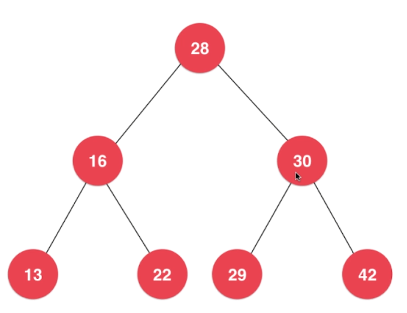

[TOC]


# 数据结构

## 时间复杂度

O(1),O(n),O(lgn),O(nlogn),O(n^2)

大O描述的是算法的运行时间和输入数据之间的关系。

### 为什么要用大O，叫做O(n)?

忽略常数，实际时间T=c1*n + c2；

| 公司              | 时间复杂度 |
| ----------------- | ---------- |
| T = 2*n +2        | O(n)       |
| T = 2000*n +10000 | O(n)       |
| T = 1*n*n+0       | O(n^2)     |

渐进时间复杂度，描述n趋近于无穷的情况。


## 数组

将数据码成一排进行存放。


编号从0开始，结束为数组长度减1.

```java
package Array;

import java.util.Date;

public class Array<E> {
    private E[] data;
    private int size;

    /**
     * 构造函数，传入数组的容量capacity构造Array
     *
     * @param capacity 数组容量
     */
    public Array(int capacity) {
        data = (E[]) new Object[capacity];
        size = 0;
    }

    /**
     * 无参数的构造函数，默认数组的容量capacity=10
     */
    public Array() {
        this(10);
    }

    /**
     * 获取数组中的元素个数
     *
     * @return 数组中元素个数
     */
    public int getSize() {
        return size;
    }

    /**
     * 获取数组的容量
     *
     * @return 数组容量
     */
    public int getCapacity() {
        return data.length;
    }

    /**
     * 返回数组是否为空
     *
     * @return 数组是否为空
     */
    public boolean isEmpty() {
        return size == 0;
    }

    /**
     * 添加一个元素
     *
     * @param e 待添加元素
     */
    public void addLast(E e) {
        if (size == data.length) {
            resize(2 * data.length);
        }
        data[size] = e;
        size++;
    }

    /**
     * 在index位置插入e
     *
     * @param index
     * @param e
     */
    public void add(int index, E e) {
        if (size == data.length) {
            resize(2 * data.length);
        }
        if (index < 0 || index > size) {
            throw new IllegalArgumentException("Add failed.Require index>=0 and index<=size.");
        }
        for (int i = size - 1; i >= index; i--) {
            data[i + 1] = data[i];
        }
        data[index] = e;
        size++;
    }

    /**
     * 扩容
     *
     * @param newCapacity
     */
    private void resize(int newCapacity) {
        E[] newDate = (E[]) new Object[newCapacity];
        for (int i = 0; i < size; i++) {
            newDate[i] = data[i];
        }
        data = newDate;
    }

    /**
     * 在所有元素之前添加一个元素
     *
     * @param e
     */
    public void addFirst(E e) {
        add(0, e);
    }

    /**
     * 获取index索引位置的元素
     *
     * @param index
     * @return
     */
    public E get(int index) {
        if (index < 0 || index >= size) {
            throw new IllegalArgumentException("Get failed. Index is illegal.");
        }
        return data[index];
    }

    /**
     * 获取最后一个元素
     *
     * @return
     */
    public E getLast() {
        return get(size - 1);
    }

    /**
     * 获取第一个元素
     *
     * @return
     */
    public E getFirst() {
        return get(0);
    }


    /**
     * 修改index位置的元素
     *
     * @param index
     * @param e
     */
    public void set(int index, E e) {
        if (index < 0 || index >= size) {
            throw new IllegalArgumentException("Set failed. Index is illegal.");
        }
        data[index] = e;
    }

    /**
     * 查找数组中是否有元素e
     *
     * @param e
     * @return
     */
    public boolean contains(E e) {
        for (int i = 0; i < size; i++) {
            if (data[i].equals(e)) {
                return true;
            }
        }
        return false;
    }

    /**
     * 查找数组中元素e所在的索引，如果不存在返回-1
     *
     * @param e
     * @return 索引or-1
     */
    public int find(E e) {
        for (int i = 0; i < size; i++) {
            if (data[i].equals(e)) {
                return i;
            }
        }
        return -1;
    }

    /**
     * 删除index位置的元素
     *
     * @param index 索引
     * @return 删除的元素
     */
    public E remove(int index) {
        if (index < 0 || index >= size) {
            throw new IllegalArgumentException("Remove failed. Index is illegal.");
        }
        E ret = data[index];
        for (int i = index + 1; i < size; i++) {
            data[i - 1] = data[i];
        }
        size--;
        data[size] = null;
        if (size == data.length / 4 && data.length / 2 != 0) {
            resize(data.length / 2);
        }
        return ret;
    }

    /**
     * 删除第一个元素
     *
     * @return 删除的元素
     */
    public E removeFirst() {
        return remove(0);
    }

    /**
     * 删除最后一个元素
     *
     * @return 删除的元素
     */
    public E removeLast() {
        return remove(size - 1);
    }

    /**
     * 从数组中删除一个元素e
     *
     * @param e 需要删除的元素
     * @return 是否删除成功
     */
    public boolean removeElement(E e) {
        int index = find(e);
        if (index != -1) {
            remove(index);
            return true;
        }
        return false;
    }

    @Override
    public String toString() {
        StringBuilder res = new StringBuilder();
        res.append(String.format("Array: size = %d , capacity = %d\n", size, data.length));
        res.append('[');
        for (int i = 0; i < size; i++) {
            res.append(data[i]);
            if (i != size - 1) {
                res.append(", ");
            }
        }
        res.append(']');
        return res.toString();
    }


}

```

## 栈

栈是一种线性结构

相比数组，栈对应的操作是数组的子集

只能从一端添加元素，也只能从一端取出元素，这一端称为栈顶。

栈是一种后进先出的数据结构，Last In First Out（LIFO）

应用：撤销，程序调用系统栈

栈的实现

```
Stack<E>
void push(E)
E pop()
E peek()
int getSize()
boolean isEmpty()
```

Stack接口

```java
package Stack;

public interface Stack <E>{
    /**
     * 获得栈的大小
     * @return 栈的大小
     */
    int getSize();

    /**
     * 栈是否为空
     * @return
     */
    boolean isEmpty();

    /**
     * 压栈
     * @param e 入栈元素
     */
    void push(E e);

    /**
     * 出栈
     * @return 出栈元素
     */
    E pop();

    /**
     * 查看栈顶元素
     * @return 栈顶元素
     */
    E peek();
}
```

ArrayStack实现

```java
package Stack;

import Array.Array;

public class ArrayStack<E> implements Stack<E> {

    Array<E> array;

    public ArrayStack(int capacity) {
        array = new Array<E>(capacity);
    }

    public ArrayStack() {
        array = new Array<E>();
    }

    /**
     * 获取栈的大小
     *
     * @return 栈的大小
     */
    public int getCapacity() {
        return array.getCapacity();
    }

    @Override
    public int getSize() {
        return array.getSize();
    }

    @Override
    public boolean isEmpty() {
        return array.isEmpty();
    }

    @Override
    public void push(E e) {
        array.addLast(e);
    }

    @Override
    public E pop() {
        return array.removeLast();
    }

    @Override
    public E peek() {
        return array.getLast();
    }


    @Override
    public String toString() {
        StringBuilder res = new StringBuilder();
        res.append("Stack: [");
        for (int i = 0; i < array.getSize(); i++) {
            res.append(array.get(i));
            if (i != array.getSize() - 1) {
                res.append(",");
            }
        }
        res.append("] top");
        return res.toString();
    }
}

```

LinkedListStack实现

```java
package Stack;

import LinkedList.LinkedList;

public class LinkedListStack <E> implements Stack<E>{

    private LinkedList<E> list;
    public LinkedListStack(){
        list = new LinkedList<E>();
    }

    @Override
    public int getSize() {
        return list.getSize();
    }

    @Override
    public boolean isEmpty() {
        return list.isEmpty();
    }

    @Override
    public void push(E e) {
        list.addFirst(e);
    }

    @Override
    public E pop() {
        return list.removeFirst();
    }

    @Override
    public E peek() {
        return list.getFirst();
    }

    @Override
    public String toString() {
        StringBuilder res = new StringBuilder();
        res.append("Stack:top ");
        res.append(list);
        return res.toString();
    }
}

```


## 队列

队列也是一种线性结构

相比数组，队列对应的操作是数组的子集

只能从一端（队尾）添加元素，只能从另一端（队首）取出元素

###  队列的接口

```java
package Queue;

public interface Queue<E> {
    /**
     * 入队
     *
     * @param e
     */
    void enqueue(E e);

    /**
     * 出队
     *
     * @return
     */
    E dequeue();

    /**
     * 查看队首
     *
     * @return
     */
    E getFront();

    /**
     * 查看队列长度
     *
     * @return
     */
    int getSize();

    /**
     * 查看队列是否为空
     *
     * @return
     */
    boolean isEmpty();
}

```

### 数组队列的实现

```java
package Queue;

import Array.Array;

public class ArrayQueue<E>  implements Queue<E>{
    private Array<E> array;

    public ArrayQueue(int capacity){
        array = new Array<E>(capacity);
    }

    public ArrayQueue(){
        array = new Array<E>();
    }

    public int getCapacity(){
        return array.getCapacity();
    }

    @Override
    public void enqueue(E e) {
        array.addLast(e);
    }

    @Override
    public E dequeue() {
        return array.removeFirst();
    }

    @Override
    public E getFront() {
        return array.getFirst();
    }

    @Override
    public int getSize() {
        return array.getSize();
    }

    @Override
    public boolean isEmpty() {
        return array.isEmpty();
    }

    @Override
    public String toString() {
        StringBuilder res = new StringBuilder();
        res.append("Queue: ");
        res.append("front [");
        for (int i = 0; i < array.getSize(); i++) {
            res.append(array.get(i));
            if (i != array.getSize() - 1) {
                res.append(", ");
            }
        }
        res.append("] tail");
        return res.toString();
    }
}

```

### 循环队列

front == tail 队列为空

(tail + 1)%c == front 队列满

有意识的浪费一个空间

```
package Queue;

public class LoopQueue<E> implements Queue<E> {
    private E[] data;
    private int front, tail;
    private int size;

    public LoopQueue(int capacity) {
        data = (E[]) new Object[capacity + 1];
        front = 0;
        tail = 0;
        size = 0;
    }

    public LoopQueue() {
        this(10);
    }

    public int getCapacity() {
        return data.length - 1;
    }


    @Override
    public void enqueue(E e) {
        if ((tail + 1) % data.length == front) {
            resize(getCapacity() * 2);
        }
        data[tail] = e;
        tail = (tail + 1) % data.length;
        size++;
    }

    private void resize(int newCapacity) {
        E[] newData = (E[]) new Object[newCapacity + 1];
        for (int i = 0; i < size; i++) {
            newData[i] = data[(i + front) % data.length];
        }
        data = newData;
        front = 0;
        tail = size;
    }

    @Override
    public E dequeue() {
        if (isEmpty()) {
            throw new IllegalArgumentException("Cannot dequeue from an empty queue!");
        }
        E ret = data[front];
        data[front] = null;
        front = (front + 1) % data.length;
        size--;
        if (size == getCapacity() / 4 && getCapacity() / 2 != 0) {
            resize(getCapacity() / 2);
        }
        return ret;
    }

    @Override
    public E getFront() {
        if(isEmpty()){
            throw new IllegalArgumentException("Queue is empty.");
        }
        return data[front];
    }

    @Override
    public int getSize() {
        return size;
    }

    @Override
    public boolean isEmpty() {
        return front == tail;
    }

    @Override
    public String toString() {
        StringBuilder res = new StringBuilder();
        res.append("Queue: ");
        res.append("front [");
        for (int i = front; i != tail; i = (i+1)%data.length) {
            res.append(data[i]);
            if ((i+1)%data.length != tail) {
                res.append(", ");
            }
        }
        res.append("] tail");
        return res.toString();
    }
}

```

链表队列

```java
package Queue;


public class LinkedLIstQueue<E>  implements Queue<E>{


    private class Node {
        public E e;
        public Node next;

        public Node(E e, Node next) {
            this.e = e;
            this.next = next;
        }

        public Node(E e) {
            this(e, null);
        }

        public Node() {
            this(null, null);
        }

        @Override
        public String toString() {
            return e.toString();
        }
    }


    private Node head,tail;
    private int size;
    public LinkedLIstQueue(){
        head = null;
        tail = null;
        size = 0;
    }


    @Override
    public void enqueue(E e) {
        if(tail == null){
            tail = new Node(e);
            head = tail;
        }else{
            tail.next = new Node(e);
            tail = tail.next;
        }
        size ++;
    }

    @Override
    public E dequeue() {
        if(isEmpty()){
            throw new IllegalArgumentException("Cannot dequeue from an empty queue.");
        }
        Node retNode = head;
        head = head.next;
        if(head == null){
            tail = null;
        }
        size --;
        return retNode.e;
    }

    @Override
    public E getFront() {
        return head.e;
    }

    @Override
    public int getSize() {
        return size;
    }

    @Override
    public boolean isEmpty() {
        return size == 0;
    }

    @Override
    public String toString() {
        StringBuilder res = new StringBuilder();
        res.append("Queue:front ");
        Node cur = head;
        while (cur!=null){
            res.append(cur + "->");
            cur = cur.next;
        }
        res.append("NULL tail");
        return res.toString();
    }
}

```


## 链表

数据存储在节点Node中。

```
class Node{
	E e;
	Node next;
}
```

优点：真正的动态，不需要处理固定容量的问题

缺点：丧失了随机访问的能力

链表不适合用于索引有语意的情况

```
package LinkedList;

public class LinkedList<E> {
    private class Node {
        public E e;
        public Node next;

        public Node(E e, Node next) {
            this.e = e;
            this.next = next;
        }

        public Node(E e) {
            this(e, null);
        }

        public Node() {
            this(null, null);
        }

        @Override
        public String toString() {
            return e.toString();
        }
    }

    private Node dummyHead;
    private int size;

    public LinkedList() {
        dummyHead = new Node(null,null);
        size = 0;
    }

    public int getSize() {
        return size;
    }

    public boolean isEmpty() {
        return size == 0;
    }


    public void add(int index,E e){
        if(index<0||index>size){
            throw new IllegalArgumentException("Add failed. Illegal index.");
        }

        Node prev=dummyHead;
        for (int i = 0; i < index; i++) {
            prev = prev.next;
        }
        prev.next = new Node(e,prev.next);
        size++;

    }

    public void addFirst(E e){
        add(0,e);
    }

    public void addLast(E e){
        add(size,e);
    }

    public E get(int index){
        if(index<0||index>size){
            throw new IllegalArgumentException("Get failed. Illegal index.");
        }
        Node cur=dummyHead.next;
        for (int i = 0; i < index; i++) {
            cur = cur.next;
        }
        return cur.e;
    }


    public E getFirst(){
        return get(0);
    }


    public E getLast(){
        return get(size-1);
    }

    public void set(int index,E e){
        if(index<0||index>size){
            throw new IllegalArgumentException("Get failed. Illegal index.");
        }
        Node cur = dummyHead.next;
        for(int i=0;i<index;i++){
            cur = cur.next;
        }
        cur.e = e;
    }


    public boolean contains(E e){
        Node cur = dummyHead.next;
        while (cur!=null){
            if(cur.e.equals(e)){
                return true;
            }
            cur = cur.next;
        }
        return false;
    }

    public E remove(int index){
        if(index<0||index>size){
            throw new IllegalArgumentException("Remove failed. Illegal index.");
        }
        Node prev = dummyHead;
        for (int i = 0; i < index; i++) {
            prev = prev.next;
        }
        Node retNode = prev.next;
        prev.next = retNode.next;
        retNode.next = null;
        size --;
        return retNode.e;
    }


    public E removeFirst(){
        return remove(0);
    }

    public E removeLast(){
        return remove(size-1);
    }

    @Override
    public String toString() {
        StringBuilder res = new StringBuilder();
        Node cur = dummyHead.next;
        while (cur!=null){
            res.append(cur+"->");
            cur = cur.next;
        }
        res.append("NULL");
        return res.toString();
    }
}

```

## 树结构



树结构本上就是一种天然的组织结构 

将数据使用树结构存储后，出奇的高效。

二分搜索树；平衡二叉树：AVL；红黑树；堆；并查集；线段树；Trie（字典树，前缀树）

### 二叉树

和链表一样的动态数据结构

```
class Node{
	E e;
	Node left;
	Node right;
}
```

二叉树（多叉树）

二叉树具有唯一根节点。

二叉树每个节点最多有两个孩子。

叶子节点的左右孩子为空。

二叉树每个节点最多有一个父亲。

二叉树具有天然的递归结构：每个节点的左子树和右子树都也是二叉树。

一个节点也是二叉树，NULL也是二叉树

### 二分搜索树

1. 二分搜索树也是二叉树。

2. 二分搜索树的每个节点的值：

   - 大与其左子树所有节点的值

   - 小于其右子树所有节点的值

3. 每一颗子树也是二分搜索树。

存储的元素必须有可比较性。因此必须元素必须实现`Comparable`接口，可比较。

```
package BST;


import java.util.LinkedList;
import java.util.Queue;
import java.util.Stack;

public class BST <E extends Comparable<E>>{
    private class Node{
        public E e;
        public Node left,right;
        public Node(E e){
            this.e = e;
            left = null;
            right = null;
        }
    }

    private Node root;
    private int size;

    public BST(){
        root = null;
        size = 0;
    }

    public int size(){
        return size;
    }

    public boolean isEmpty(){
        return size==0;
    }

    public void add(E e){
        if(root ==null){
            root = new Node(e);
            size ++;
        }else{
            add(root,e);
        }
    }
    private Node add(Node node,E e){
        if(node == null){
            size++;
            return new Node(e);
        }
//        if(e.equals(node.e)){
//            return;
//        }
//        if(e.compareTo(node.e)<0 && node.left == null) {
//            node.left = new Node(e);
//            size++;
//            return;
//        }else if(e.compareTo(node.e)>0 && node.right == null){
//            node.right = new Node(e);
//            size++;
//            return;
//        }
        if(e.compareTo(node.e)<0){
            node.left = add(node.left,e);
        }else if (e.compareTo(node.e)>0){
            node.right = add(node.right,e);
        }

        return node;
    }


    public boolean contains(E e){
            return contains(root,e);
    }
    private boolean contains(Node node,E e){
        if(node==null){
            return false;
        }
        if(e.compareTo(node.e)==0){
            return true;
        }else if(e.compareTo(node.e)<0){
            return contains(node.left,e);
        }else{
            return contains(node.right,e);
        }
    }

    /**
     * 前序遍历
     */
    public void preOrder(){
        preOrder(root);
    }
    private void preOrder(Node node){
        if(node==null){
            return;
        }
        System.out.println(node.e);
        preOrder(node.left);
        preOrder(node.right);
    }

    /**
     * 中序遍历
     */
    public void inOrder(){
        inOrder(root);
    }
    private void inOrder(Node node){
        if(node==null) {
            return;
        }
        inOrder(node.left);
        System.out.println(node.e);
        inOrder(node.right);
    }

    /**
     * 后续遍历
     */
    public void postOrder(){
        postOrder(root);
    }
    private void postOrder(Node node){
        if(node==null) {
            return;
        }
        postOrder(node.left);
        postOrder(node.right);
        System.out.println(node.e);
    }

    /**
     * 前序遍历非递归
     */
    private void preOrderNR(){
        Stack<Node> stack = new Stack<Node>();
        stack.push(root);
        while (!stack.isEmpty()){
            Node cur = stack.pop();
            System.out.println(cur.e);
            if(cur.right!=null){
                stack.push(cur.right);
            }
            if(cur.left!=null){
                stack.push(cur.left);
            }
        }
    }

    /**
     * 层序遍历
     */
    public void levelOrder(){
        Queue<Node> q = new LinkedList<Node>();
        q.add(root);
        while (!q.isEmpty()){
            Node cur = q.remove();
            System.out.println(cur.e);
            if(cur.left!=null){
                q.add(cur.left);
            }
            if(cur.right!=null){
                q.add(cur.right);
            }
        }
    }


    /**
     * 寻找最小元素
     * @return
     */
    public E minimum(){
        if(size == 0){
            throw new IllegalArgumentException("BST is empty!");
        }
        return minimum(root).e;
    }

    private Node minimum(Node node) {
        if(node.left == null){
            return node;
        }
        return minimum(node.left);
    }


    /**
     * 寻找最大元素
     * @return
     */
    public E maximum(){
        if(size == 0){
            throw new IllegalArgumentException("BST is empty!");
        }
        return maximum(root).e;
    }

    private Node maximum(Node node) {
        if(node.right == null){
            return node;
        }
        return maximum(node.right);
    }

    /**
     * 删除最小元素
     * @return
     */
    public E removeMin(){
        E ret = minimum();
        root = removeMin(root);
        return ret;
    }

    private Node removeMin(Node node) {
        if(node.left == null){
            Node rightNode = node.right;
            node.right = null;
            size--;
            return rightNode;
        }else{
            node.left = removeMin(node.left);
        }
        return node;
    }


    /**
     * 删除最大元素
     * @return
     */
    public E removeMax(){
        E ret = maximum();
        root = removeMax(root);
        return ret;
    }

    private Node removeMax(Node node) {
        if(node.right == null){
            Node leftNode = node.left;
            node.left = null;
            size--;
            return leftNode;
        }else{
            node.right = removeMax(node.right);
        }
        return node;
    }

    /**
     * 删除元素e
     * @param e
     */
    public void remove(E e){
        root = remove(root,e);
    }

    private Node remove(Node node, E e) {
        if(node == null){
            return null;
        }
        if(e.compareTo(node.e)<0){
            node.left = remove(node.left,e);
        }else if(e.compareTo(node.e)>0){
            node.right = remove(node.right,e);
        }else{
            if(node.left == null){
                Node rightNode = node.right;
                node.right = null;
                size --;
                return rightNode;
            }else if(node.right == null){
                Node leftNode = node.left;
                node.left = null;
                size --;
                return leftNode;
            }else{
                //找到比待删除节点的大的最小节点，即待删除节点右子树的最小节点
                //用这个节点顶替待删除节点位置
                Node successor = minimum(node.right);
                successor.right = removeMin(node.right);
                successor.left = node.left;
                node.left = node.right = null;
                return successor;
            }
        }
        return node;
    }


    @Override
    public String toString() {
        StringBuilder res = new StringBuilder();
        generateBSTString(root,0,res);
        return res.toString();
    }

    private void generateBSTString(Node node, int depth,StringBuilder res) {
        if(node == null){
            res.append(generateDepthString(depth)+"null\n");
            return;
        }
        res.append(generateDepthString(depth)+node.e+"\n");
        generateBSTString(node.left,depth+1,res);
        generateBSTString(node.right,depth+1,res);
    }

    private String generateDepthString(int deptn) {
        StringBuilder res = new StringBuilder();
        for (int i = 0; i < deptn; i++) {
            res.append("--");
        }
        return res.toString();
    }
}

```

#### 前序遍历

```
    /**
     * 前序遍历
     */
    public void preOrder(){
        preOrder(root);
    }
    private void preOrder(Node node){
        if(node==null){
            return;
        }
        System.out.println(node.e);
        preOrder(node.left);
        preOrder(node.right);
    }
```

#### 非递归的前序遍历

```java
    /**
     * 前序遍历非递归
     */
    private void preOrderNR(){
        Stack<Node> stack = new Stack<Node>();
        stack.push(root);
        while (!stack.isEmpty()){
            Node cur = stack.pop();
            System.out.println(cur.e);
            if(cur.right!=null){
                stack.push(cur.right);
            }
            if(cur.left!=null){
                stack.push(cur.left);
            }
        }
    }
```

#### 中序遍历 二叉排序树的中序遍历是有序的。

```
    /**
     * 中序遍历
     */
    public void inOrder(){
        inOrder(root);
    }
    private void inOrder(Node node){
        if(node==null) {
            return;
        }
        inOrder(node.left);
        System.out.println(node.e);
        inOrder(node.right);
    }
```

#### 后序遍历 释放内存的话，需要采用后续遍历。

```
    /**
     * 后续遍历
     */
    public void postOrder(){
        postOrder(root);
    }
    private void postOrder(Node node){
        if(node==null) {
            return;
        }
        postOrder(node.left);
        postOrder(node.right);
        System.out.println(node.e);
    }
```

#### 层序遍历

```
    /**
     * 层序遍历
     */
    public void levelOrder(){
        Queue<Node> q = new LinkedList<Node>();
        q.add(root);
        while (!q.isEmpty()){
            Node cur = q.remove();
            System.out.println(cur.e);
            if(cur.left!=null){
                q.add(cur.left);
            }
            if(cur.right!=null){
                q.add(cur.right);
            }
        }
    }
```

#### 寻找最小值

```
    /**
     * 寻找最小元素
     * @return
     */
    public E minimum(){
        if(size == 0){
            throw new IllegalArgumentException("BST is empty!");
        }
        return minimum(root).e;
    }

    private Node minimum(Node node) {
        if(node.left == null){
            return node;
        }
        return minimum(node.left);
    }
```

#### 寻找最大值

```
    /**
     * 寻找最大元素
     * @return
     */
    public E maximum(){
        if(size == 0){
            throw new IllegalArgumentException("BST is empty!");
        }
        return maximum(root).e;
    }

    private Node maximum(Node node) {
        if(node.right == null){
            return node;
        }
        return maximum(node.right);
    }
```

#### 删除最小元素

```
    /**
     * 删除最小元素
     * @return
     */
    public E removeMin(){
        E ret = minimum();
        root = removeMin(root);
        return ret;
    }

    private Node removeMin(Node node) {
        if(node.left == null){
            Node rightNode = node.right;
            node.right = null;
            size--;
            return rightNode;
        }else{
            node.left = removeMin(node.left);
        }
        return node;
    }

```

#### 删除最大元素

```
    /**
     * 删除最大元素
     * @return
     */
    public E removeMax(){
        E ret = maximum();
        root = removeMax(root);
        return ret;
    }

    private Node removeMax(Node node) {
        if(node.right == null){
            Node leftNode = node.left;
            node.right = null;
            size--;
            return leftNode;
        }else{
            node.right = removeMax(node.right);
        }
        return node;
    }
```

#### 删除某个元素

```
    /**
     * 删除元素e
     * @param e
     */
    public void remove(E e){
        root = remove(root,e);
    }

    private Node remove(Node node, E e) {
        if(node == null){
            return null;
        }
        if(e.compareTo(node.e)<0){
            node.left = remove(node.left,e);
        }else if(e.compareTo(node.e)>0){
            node.right = remove(node.right,e);
        }else{
            if(node.left == null){
                Node rightNode = node.right;
                node.right = null;
                size --;
                return rightNode;
            }else if(node.right == null){
                Node leftNode = node.left;
                node.left = null;
                size --;
                return leftNode;
            }else{
                //找到比待删除节点的大的最小节点，即待删除节点右子树的最小节点
                //用这个节点顶替待删除节点位置
                Node successor = minimum(node.right);
                successor.right = removeMin(node.right);
                successor.left = node.left;
                node.left = node.right = null;
                return successor;
            }
        }
        return node;
    }
```

#### floor 

#### ceil

#### rank

元素排名

#### select

排名第X号元素


## 字典树（Trie）


Tire包含4个东西

1. root节点
2. 孩子节点 HashMap<val,Trie>
3. 结束Flag  boolean
4. 对应值 String int ...

```java
public class Trie {
    //前缀树节点
    public class TrieNode{
        //路过当前节点的单词数目
        public int path;
        //以此为结尾的单词数目
        public int end;
        //当前节点所能链接到的节点
        public HashMap<Character, TrieNode> next;

        public TrieNode(){
            path = 0;
            end = 0;
            next = new HashMap<>();
        }
    }


    private TrieNode root;
    public Trie(){
        root = new TrieNode();
    }

    public void insert(String word){
        if(word == null || word.equals(""))  return ;
        TrieNode node = root;
        for(int i = 0; i<word.length(); i++){
            char ch = word.charAt(i);
            if(!node.next.containsKey(ch)) {
                node.next.put(ch,new TrieNode());
            }
            node = node.next.get(ch);
            //路过此节点一次
            node.path++;
        }
        //单词结束，最后一个节点的end加1
        node.end++;
    }

    public boolean search(String word){
        if(word == null || word.equals("")) return false;
        TrieNode node = root;
        for(int i = 0; i<word.length(); i++){
            char ch = word.charAt(i);
            if(!node.next.containsKey(ch)) return false;
            node = node.next.get(ch);
        }
        //如果结尾不为0，那么不是一个单词
        if(node.end == 0) return false;
        return true;
    }
    public boolean startsWith(String word){
        //和查找相同，只是不用判别end
        if(word == null || word.equals("")) return false;
        TrieNode node = root;
        for(int i = 0; i<word.length(); i++){
            char ch = word.charAt(i);
            if(!node.next.containsKey(ch)) return false;
            node = node.next.get(ch);
        }
        return true;
    }
}

/**
 * Your Trie object will be instantiated and called as such:
 * Trie obj = new Trie();
 * obj.insert(word);
 * boolean param_2 = obj.search(word);
 * boolean param_3 = obj.startsWith(prefix);
 */
```

