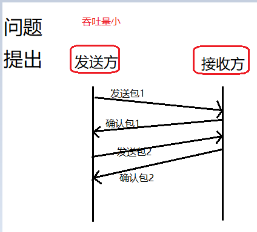
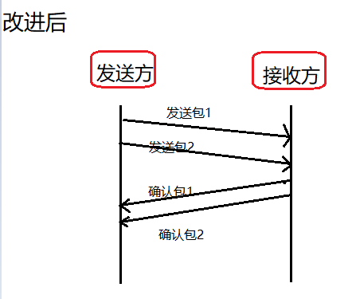
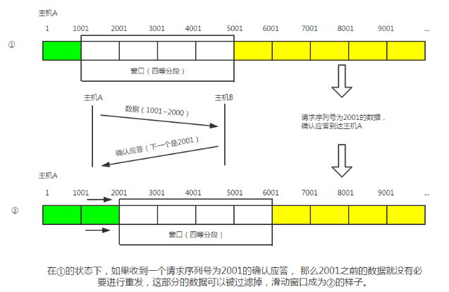
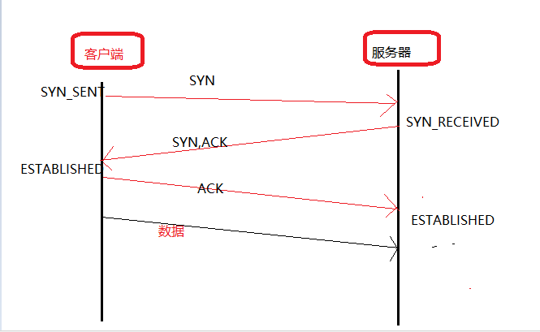
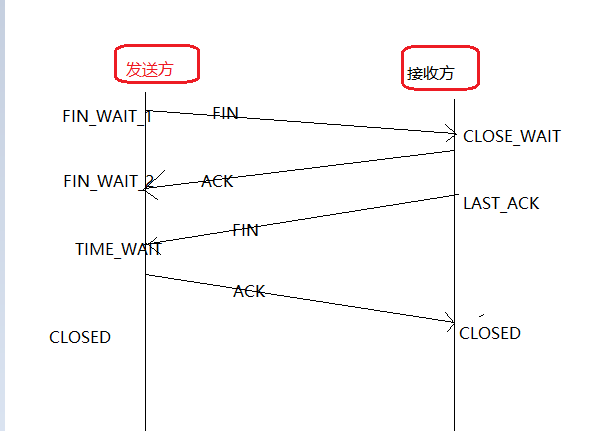
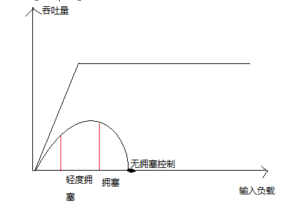
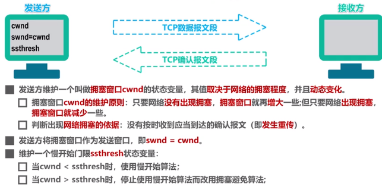
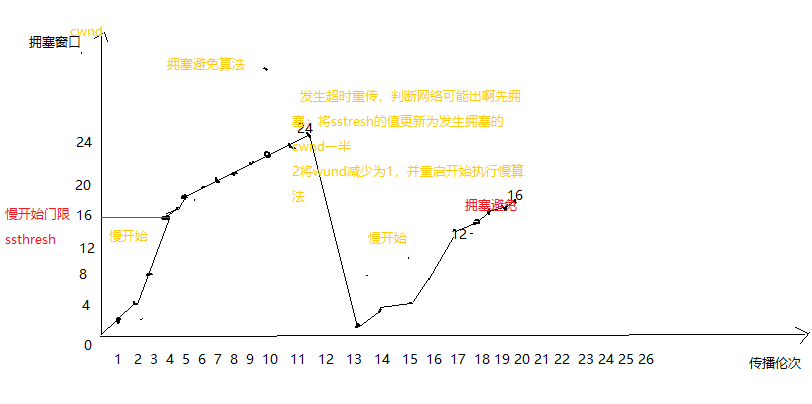
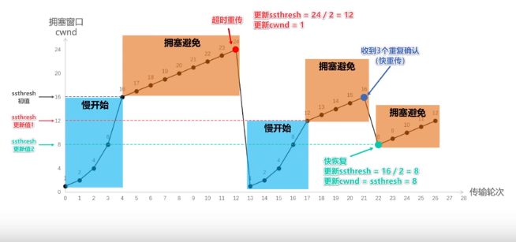

[TOC]

# 网络

## 基础

### 一，计算机网络的功能

1. 资源共享：硬件共享，软件共享，提高资源利用率
2. 数据通信：计算机之间传递信息
3. 进行数据信息的集中和综合处理：将分散各地的计算机数据资料进行集中管理
4. 均衡负载，相互协作：可以通过网络合理的分配任务
5. 提高了系统的可靠性和可用性：当网中某一个处理机出现故障，可以有别的代为处理，例子：容灾系统
6. 进行分布式的处理：采用合适的算法将任务分散在网中不同的计算机上进行分布式处理

### 二，计算机网络的物理组成

硬件系统：指构成局域网的所有物理设备的总和

1. 服务器：高性能计算机，用于网络管理，运行应用程序，处理各种请求信息
2. 工作站：由服务器进行管理和提供服务的，连入网络的任何计算机都属于工作站
3. 传输介质：用于网络设备之间通信的网络电缆
4. 网卡：网络适配器，在局域网中将计算机与网络相连接的设备
5. 交换机：用于处理与高宽带相关协议配套的多层设备， 具有数据转发，过滤等功能，适用于数据量大，通信频繁的网络
6. 集线器：用来连接多台计算机或局域网络的设备
7. 调制解调器：用来实现模拟和数字信号之间转换的设备
8. 路由器：一种网络层设备，可互联局域网和广域网，并且当网络上两端存在多条通路的时候，可以提供交通控制和筛选功能，选择信息通路
9. 光纤：玻璃制成的传输介质，通常用于高速通信线路的连接
10. 终端：没有中央处理器的网络工作站，在早期网络中采用

软件系统

1. 网络通信协议：一组规定和约定的准则。
2. 网络操作系统：使网络上多台计算机方便而有效的共享网络资源，为用户提供各种所需的服务。网络操作系统除了具备单机操作系统所需的功能外，还需要提供高效可靠的网络通信能力和提供多项网络服务的功能
3. 网络应用软件：构建在网络操作系统的应用程序，满足网络用户的不同需求，如网络数据库软件，网络通信软件

#### 网络传输

不可靠哪些方面：

   丢包，重复包

   出错

   乱序

不安全方面：

  中间人

  窃取

  篡改  

### 三，什么是ARP和RARP？

ARP（Address Resolution Protocol）：地址解析协议，用来将逻辑地址解析成物理地址

RARP（Reverse Address Resolution Protocol）：将物理地址转化为逻辑地址

## TCP/IP协议

### 一，什么是TCP？

TCP/IP，中文译名为传输控制协议/因特网互联协议，又叫网络通讯协议。这个协议是Intenet最基本的协议，也是Intenet的基础。简单的说，他的名字是由网络层的IP协议和传输层的tcp协议组成的。TCP/IP协议定义了电子设备如何进入因特网，以及数据如何在他们之间传输的标准。

TCP/IP协议是一组包括TCP协议，IP协议，UDP协议、ICMP协议和其他一些协议的协议组。

Transport Control Protocol：面向连接的协议，用三次握手和滑动窗口机制来保证传输的可靠性和进行流量控制

例：滑动窗口协议

滑动窗口协议如何运行，解决了什么问题？

滑动窗口机制为端到端设备间的数据传输提供了可靠的流量控制机制。然而，它只能在源端设备和目的端设备起作用，当网络中间设备(例如路由器等)发生拥塞时，滑动窗口机制将不起作用。

​     TCP协议中使用

​     维持发送方/接收方缓冲区，互相商定如何接受包

​     

   

  改进后，时间缩短，吞吐量明显增大，但是发送的数据量（窗口）是多少呢，如何确定收到回复包呢？

滑动窗口的实现

参考：<https://blog.51cto.com/14309541/2390111>

滑动窗口协议，

上图中的窗口内的数据几遍没有收到确认应答也可以放出去。不过在整个窗口的确认应答没有达到之前，如果其中部分数据出现丢包，那么发送端仍然要负责重新传。为此发送端主机需要设置缓存保留这些被待重传的数据，直到收到他们的确认应答为止。如果如期收到确认应答就可以不再进行重发，此时数据就可以冲缓冲区清楚掉。如果在长时间没有得到确认的情况下，会有超时重传协议。

###  二，TCP和IP的关系

TCP和IP是独立且联系紧密的，负责管理和引导数据的传输。TCP在传输层，IP协议在网络层，TCP协议负责和远程主机的连接，IP负责寻址，将报文发送到指定位置。

### 三，http会话的4个过程

1 建立连接(建立TCP连接)

2请求

3应答

4关闭

#### TCP之三次握手，四次挥手

   网络是不可靠的，任何包都有可能丢失

   遇见问题，解决问题，不断迭代

   能用就好

​    四次挥手

​              

 第一次挥手：当传输的数据到达尾部时，host1向host2发送FIN=1标志位；可理解成，host1向host2说，我这边的数据传送完成了，我准备断开了连接；

第二次挥手：因TCP的连接是全双工的双向连接，关闭也是要从两边关闭；当host2收到host1发来的FIN=1的标志位后，host2不会立刻向host1发送FIND=1的请求关闭信息，而是先向host1发送一个ACK=1的应答信息，表示：你请求关闭的请求我已经收到，但我可能还有数据没有完成传送，你再等下，等我数据传输完成了我就告诉你；

第三次挥手：host2数据传输完成，向host1发送FIN=1，host1收到请求关闭连接的请求后，host1就明白host2的数据已传输完成，现在可以断开连接了，

第四次挥手：host1收到FIND=1后，host1还是怕由于网络不稳定的原因，怕host2不知道他要断开连接，于是向host2发送ACK=1确认信息进行确认，把自己设置成TIME_WAIT状态并启动定时器，如果host2没有收到ACK，host2端TCP的定时器到达后，会要求host1重新发送ACK，当host2收到ACK后，host2就断开连接；当host1等待2MLS（2倍报文最大生存时间）后，没有收到host2的重传请求后，他就知道host2已收到了ACK，所以host1此时才关闭自己的连接。

### 四，OSI参考模型

   应用层  http,httpspops

  表示层  处理信息的表达方式，解密加密 数据压缩

  会话层    管理和协调不同主机上各种简称之间的通信（对话），即负责建立、管理和终止进程之间的会话、。

  传输层    tcp udp为上层提供端到端的可靠和透明的数据传输服务。tcp面向连接 udp面向无连接

  网络层       包，分组，通过寻址，本层通过寻址建立两点之间的连接，为源端的运输层送来分组，选择合适的路由和交换节点。路由选择协议（rip），通过路由一级一级传递

  数据链路层    MAC地址，数据分帧，数据流量控制，差错控制，（网卡，网桥，交换机）

  物理层      比特流 处于参考模型的最底层，利用物理传输介质为数据链路提供物理连接，透明的传输比特流，常用的设备，集线器，中继器，调制解调器

#### 五，TCP通信的原理以及特点 

​     (1)面向连接的服务

​     (2) 端到端的通信

​     (3)可靠性，确保数据传输的正确性，不出现丢失或乱序。

​      (4)采用字节流的方式，即及字节为单位传输字节序列

#### 六，TCP的拥塞控制，具体过程是怎么样的？UDP有拥塞控制吗？如何解决？

​      拥塞控制：在某段时间内，对网络中某一资源的需求量超过了该资源所能提供的可用部分，网络性能就要变坏，这种情况就叫做拥塞。

​     在计算机网络中的链路容量（即带宽）、交换节点中的缓存和处理机等，都是网络资源

若出现拥塞而不进行控制，整个网络的吞吐量就会随输入符合的增大而减小。

拥塞控制的四种算法：

慢开始   拥塞避免    快重传    快恢复

这四种算法的基本控制原理，假定如下：

1 数据是单方面传送，而另一个方向只传送确认

2 接收方总是有足够大的缓存空间，因而发送方发送窗口的大小由网络的拥塞程度决定

3 以TCP报文段的个数为讨论问题的单位，而不是以字节为单位。

​          

慢开始，是一开始向网络注入的报文少，并不是指拥塞窗口的cwnd的增长速度慢；

拥塞避免，并非完全能够避免拥塞，而是在拥塞避免阶段将拥塞窗口控制为线性增长，使网络不那么拥塞。

快重传：使发送方尽快进行重传，而不是等待超时重传计算器超时再重传。

要求接收方不要等待自己发送数据才进行捎带确认，而是要立即发送确认；

即使收到了失序的报文段也要立即发出对已收到的报文段的重复确认。

发送方一旦收到3个连续的重复确认，就将相应的报文立即重传，而不是等该报文的超时重传计时时才重传。

udp没有拥塞控制

## UDP

### 一，什么是UDP？

User Datagram Protocol：面向无连接的不可靠传输层协议。

（1）UDP是一个无连接协议，传输数据之前源端和终端不建立连接，当它想传送时，就简单的去抓来应用程序的数据来使用，并尽可能快的把它扔到网络上。

（2）不去维护网络的状态，包括收发状态等。

（3）字节开销很小。

（4）吞吐量主要受营运软件生成数据的速率、传输带宽、源端和终端主机性能等因素的限制。

## HTTP

### 一，为什么客户端提交要使用post请求不用get

1. 不安全（在URL中直接可以看到携带的参数）
2. url中只可以携带小于2k的数据（post请求参数在消息体中）
3. 编码方式只适用于消息体，Get请求的URL中如果出现中文，用的是tomcat 默认的编解码格式ISO-8859-1，tomcat安装目录的conf里面的server.xml里面配置Tomcat默认采用UTF-8解码
4. 刷新的时候，get不会有任何提示，post会弹出提示框，问用户是否重新提交。

## HTTPS

超文本传输协议HTTP协议被用于在Web浏览器和网站服务器之间传递信息，HTTP协议以明文方式发送内容，不提供任何方式的数据加密，如果攻击者截取了Web浏览器和网站服务器之间的传输报文，就可以直接读懂其中的信息，因此，HTTP协议不适合传输一些敏感信息，比如：信用卡号、密码等支付信息。

　　为了解决HTTP协议的这一缺陷，需要使用另一种协议：安全套接字层超文本传输协议HTTPS，为了数据传输的安全，HTTPS在HTTP的基础上加入了SSL协议，SSL依靠证书来验证服务器的身份，并为浏览器和服务器之间的通信加密。

区别：

  http是超文本传输协议，信息是明文传输，https则是具有安全性ssl的加密传输协议

 http和https使用的是完全不同的连接方式，用的端口也不一样，前者是80，后者是443

http连接很简单，是无状态的。Https协议是由SSL+Http协议构建的可进行加密传输、身份认证的网络协议，比http协议安全

